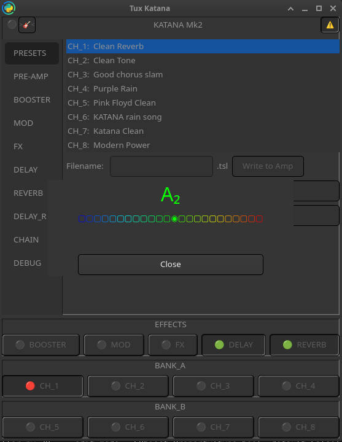
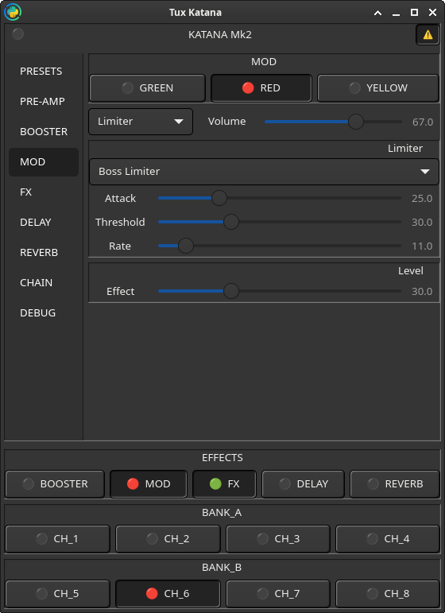

# TuxKatana

> Gtk4 Python3 interface to communicate and configure Boss Katana Mk2 Amp 


## Disclaimer

	⚠️  WARNING : this app is a work in progress  
	✅ But is working enough
	
    ⚠️  WARNING-2 : this app works in "Edit Mode" all the time :
    the reason is : 
    without it the Katana is not sending back other parameters 
    changing with that one you changed  
    ✅ But gives a better experience
    for example, you'll see 'Rate' scale moving with 'Volume' for Flanger
    
    You can switch OFF Edit Mode by clicking on [⚠️]  in the up-right corner
    
    >>> Save your presets first
    
    PS: switching off/on the amp makes it reload its old config
    

## Demo

    (made with bad resolution and sound level, need to retry ^^')

> [YT - Demo](https://www.youtube.com/watch?v=bfD31DUedUE)

## Snapshots examples





## Missing

* Presets Save/Load
* CHAINs 

## Install

Python Requirements:

	gtk4 mido bidict collections sounddevice (for Tuner)


## Tuner

The USB system brings Katana Pulseaudio sources/sinks :
```bash
$ pactl list short sources | grep KATANA
21	alsa_output.usb-BOSS_KATANA-01.HiFi__Line2__sink.monitor	module-alsa-card.c	s32le 2ch 44100Hz	RUNNING
22	alsa_output.usb-BOSS_KATANA-01.HiFi__Line1__sink.monitor	module-alsa-card.c	s32le 2ch 44100Hz	RUNNING
23	alsa_input.usb-BOSS_KATANA-01.HiFi__Line4__source	module-alsa-card.c	s32le 2ch 44100Hz	RUNNING
24	alsa_input.usb-BOSS_KATANA-01.HiFi__Line3__source	module-alsa-card.c	s32le 2ch 44100Hz	RUNNING
```
> For a better 'Tuner' experience: __boost__ the 'KATANA DI Capture' in _pavucontrol_ (here : Line4)

## Adding Interface

   2 files to create:

### params/your_interface.yaml

see: [HOW](./HOW.md)

format :
```yaml
    SEND:
        variable: "XX XX XX XX"     # XX -> hex str expression of address 
    RECV:
        "XX XX XX XX": 'variable'   # addresses to only be readen
    Types:
        "Name": "XX"                # XX: hex code of model
```

### widgets/your_interface.py

    add GObjet.properties:

   * int for scales with simple byte ending with '_lvl'
   * float for scales with double bytes ending with '_lvl'
   * bool for switches ending with 'sw'
   * str for Types stored 'NAME': 'XX' MIDIBytes('XX') insures it's base128 conversion
   * same name as type plus '_idx' -> helps connecting to ComboBox class named ComboStore

> template.py has some examples

